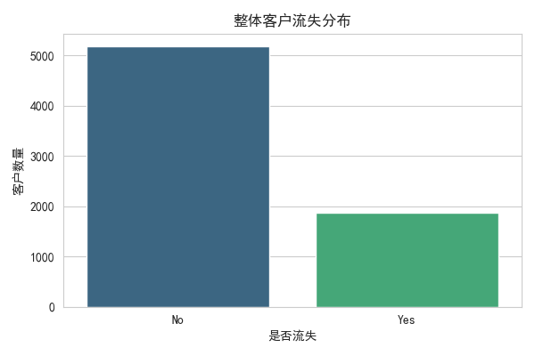
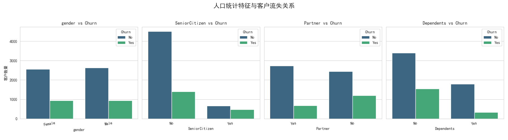
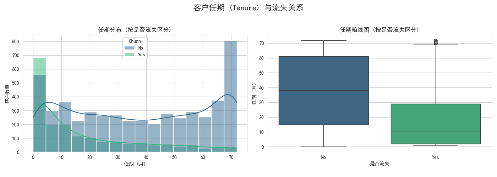
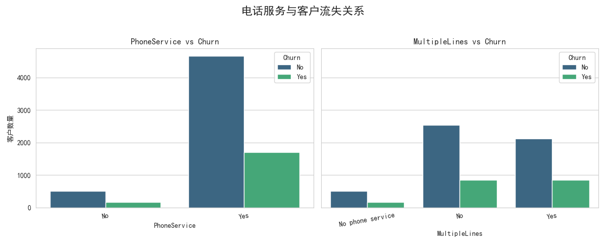
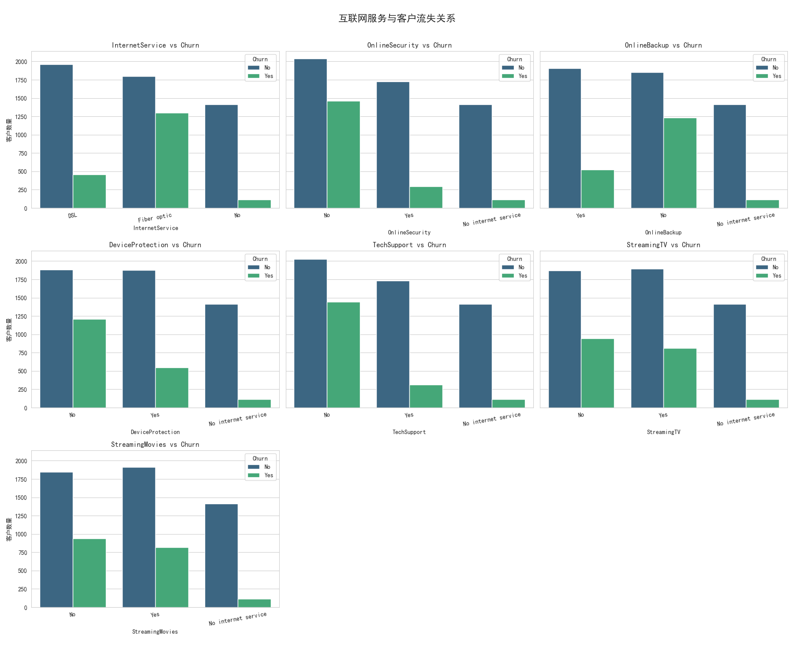
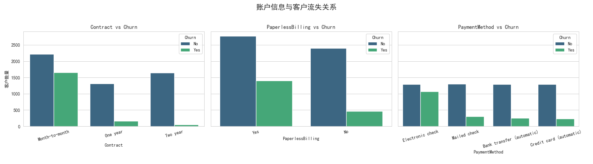
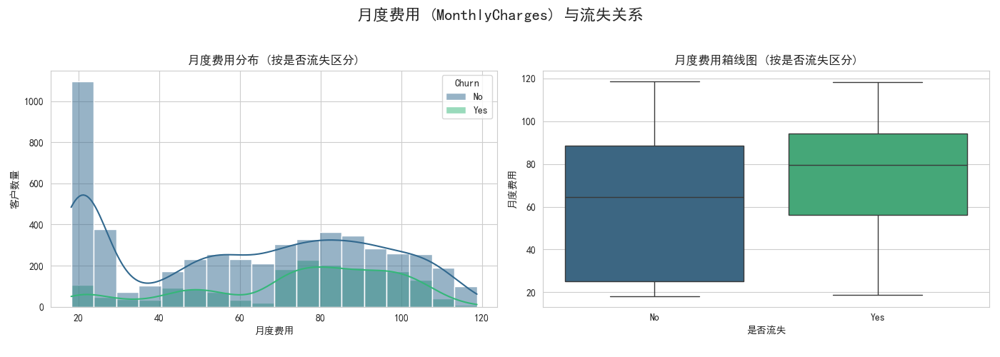
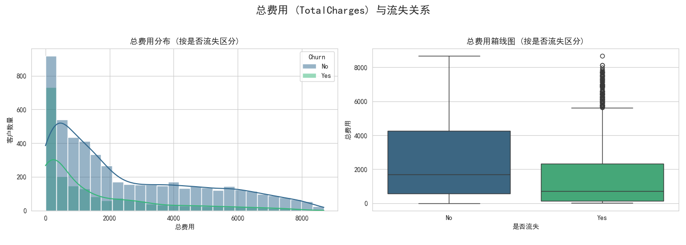

# 电信客户流失分析报告

## 1. 简介

本报告旨在分析电信客户数据集，探究影响客户流失的关键因素。通过对客户的人口统计信息、账户信息、以及所使用的服务进行分析，结合可视化图表，识别流失客户的特征，为制定客户保留策略提供数据支持。

## 2. 数据概览与清洗

*   **数据源**: `customer_churn_telecom_services.csv`
*   **总记录数**: 7043 条客户记录
*   **特征**: 包含客户性别、是否老年人、是否有伴侣/家属、在网时长（tenure）、电话/互联网服务使用情况、合同类型、支付方式、月度/总费用等20个字段。
*   **数据清洗**:
    *   `TotalCharges`（总费用）字段存在11个非数值记录（对应在网时长为0的客户），已将其总费用填充为0。
    *   `SeniorCitizen`（是否老年人）字段已从 0/1 转换为 'No'/'Yes'。
    *   `customerID` 字段已移除，因为它对分析无直接作用。
    *   数据集中无其他缺失值。

## 3. 整体客户流失情况

对整体客户流失情况进行分析：

*   **流失率**: 数据集中客户的总体流失率为 **26.54%**。
*   **未流失率**: 保持服务的客户占比为 **73.46%**。

## 4. 人口统计特征分析

分析性别、是否老年人、是否有伴侣、是否有家属等人口统计特征与客户流失的关系：

*   **性别 (gender)**: 男性与女性客户的流失率差异不大。
*   **老年客户 (SeniorCitizen)**: 老年客户的流失率显著高于非老年客户。
*   **伴侣 (Partner)**: 没有伴侣的客户流失率更高。
*   **家属 (Dependents)**: 没有家属的客户流失率更高。

## 5. 在网时长 (Tenure) 分析

分析客户在网时长与流失行为的关系：

*   **平均在网时长**:
    *   未流失客户: 约 37.6 个月
    *   已流失客户: 约 18.0 个月
*   **分布**: 流失客户的在网时长主要集中在较短的月份（尤其是前几个月），而未流失客户的在网时长分布更广，且有大量长期客户。这表明在网时长短是预测流失的重要因素。

## 6. 服务使用情况分析

### 6.1 电话服务

*   **电话服务 (PhoneService)**: 是否开通电话服务对流失率影响不大。
*   **多线服务 (MultipleLines)**: 开通多线服务的客户流失率略高于未开通或无电话服务的客户。

### 6.2 互联网服务

分析互联网服务类型及附加服务（在线安全、在线备份、设备保护、技术支持、流媒体电视/电影）与流失的关系：

*   **互联网服务类型 (InternetService)**: 使用光纤（Fiber optic）服务的客户流失率显著高于使用DSL或没有互联网服务的客户。
*   **附加服务**:
    *   未订购在线安全 (OnlineSecurity)、在线备份 (OnlineBackup)、设备保护 (DeviceProtection)、技术支持 (TechSupport) 服务的客户流失率明显更高。这表明这些增值服务可能有助于提高客户粘性。
    *   流媒体电视 (StreamingTV) 和流媒体电影 (StreamingMovies) 服务对流失率的影响相对较小，但订购了这些服务的客户流失率略高（可能与光纤用户重合度高有关）。

## 7. 账户信息分析

分析合同类型、是否电子账单、支付方式与流失的关系：

*   **合同类型 (Contract)**: 按月付费（Month-to-month）的客户流失率远高于签订一年期（One year）或两年期（Two year）合同的客户。长期合同对降低流失率效果显著。
*   **电子账单 (PaperlessBilling)**: 使用电子账单的客户流失率更高。
*   **支付方式 (PaymentMethod)**: 使用电子支票（Electronic check）支付的客户流失率最高，而自动转账（Bank transfer (automatic)）和信用卡支付（Credit card (automatic)）的客户流失率较低。

## 8. 费用分析

### 8.1 月度费用 (MonthlyCharges)

*   **分布**: 流失客户的月度费用倾向于集中在较高的区间（特别是70-100之间），而未流失客户的月度费用分布更广，包含大量低费用客户。

### 8.2 总费用 (TotalCharges)

*   **分布**: 流失客户的总费用普遍偏低，这与他们较短的在网时长相对应。未流失客户的总费用分布广泛，包含大量高总费用的长期客户。

### 8.3 数值特征相关性

分析在网时长、月度费用、总费用之间的相关性：

*   `tenure` 与 `TotalCharges` 呈强正相关 (0.83)，符合预期（在网时间越长，总费用越高）。
*   `MonthlyCharges` 与 `TotalCharges` 呈中等强度正相关 (0.65)。
*   `tenure` 与 `MonthlyCharges` 呈弱正相关 (0.25)。

## 9. 结论与发现

综合以上分析，可以得出以下关键发现：

*   **高流失风险群体特征**:
    *   在网时长短（尤其是新客户）
    *   签订按月付费合同
    *   使用光纤互联网服务
    *   月度费用较高
    *   未使用在线安全、在线备份、设备保护、技术支持等附加服务
    *   老年客户
    *   无伴侣/家属的客户
    *   使用电子支票支付方式
    *   使用电子账单
*   **低流失风险群体特征**:
    *   在网时间长
    *   签订长期合同（一年/两年）
    *   未使用互联网服务或使用DSL
    *   订购了较多附加保护/支持类服务
    *   使用自动付款方式（银行转账/信用卡）

这些发现可以为电信公司制定针对性的客户保留策略提供依据，例如：为新客户和按月付费客户提供转向长期合同的激励；加强对光纤用户的关怀和增值服务推荐；优化支付方式体验，引导客户使用自动支付；关注老年、无伴侣/家属客户群体的需求。 