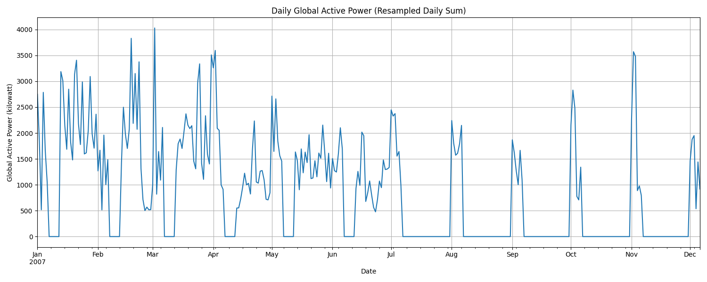
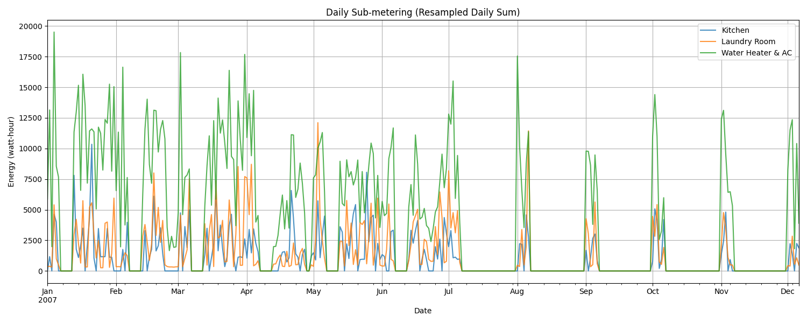
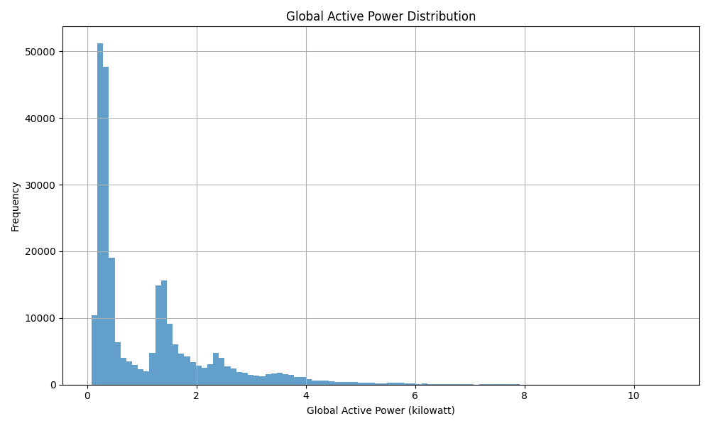
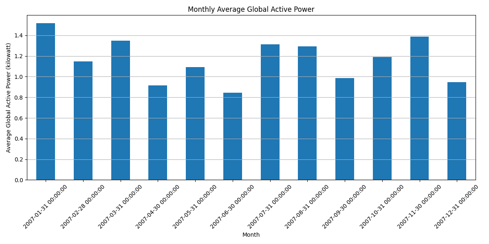

# 家庭用电数据分析报告

## 引言

本报告旨在总结通过 `power_analysis.py` 脚本对 `household_power_consumption.csv` 数据集进行的家庭用电情况分析。分析涵盖了数据加载、预处理以及探索性数据分析和可视化，旨在揭示家庭用电的主要模式和特征。

## 数据加载与准备

数据加载过程由 `load_power_data` 函数完成。关键步骤包括：
1.  读取原始 CSV 文件 (`household_power_consumption.csv`)，使用逗号作为分隔符。
2.  将原始数据中的 `Date` 和 `Time` 字符串列合并，并尝试解析为统一的 `Datetime` 对象。脚本能够处理多种常见的日期时间格式。
3.  将表示缺失值的特殊字符（如 `?`）识别为 NaN。
4.  将生成的 `Datetime` 列设置为数据框的索引，便于进行时间序列分析。
5.  移除了原始的 `Date` 和 `Time` 列。

## 数据预处理

加载数据后，使用 `preprocess_data` 函数进行数据清洗和准备，主要操作如下：
1.  识别各数据列中的缺失值 (NaN)。
2.  采用前向填充（`ffill`）策略填充所有列的缺失值。这基于一个假设，即短时间内的用电量是相对连续的。
3.  将所有包含数值信息的列（如功率、电流等）转换为统一的 `float` 数据类型，确保后续计算和分析的准确性。

## 探索性分析与可视化

通过 `explore_and_visualize` 函数，对预处理后的数据进行了探索性分析，并生成了以下可视化图表：

### 每日总有功功率

该时序图展示了每日（通过对分钟级数据求和得到）消耗的总有功功率（单位：千瓦）。通过此图可以观察到用电量的长期趋势和周期性波动。

### 每日分项计量用电

此图分别绘制了三个分项计量设备的每日总用电量（单位：瓦时）：
*   Sub_metering_1: 厨房区域
*   Sub_metering_2: 洗衣房区域
*   Sub_metering_3: 热水器和空调系统
这有助于了解不同功能区域的用电量贡献和使用模式。

### 总有功功率分布

该直方图展示了数据集中分钟级总有功功率（单位：千瓦）的频率分布。可以看出，大多数时间点的功率消耗集中在较低的数值范围。

### 每月平均总有功功率

此柱状图展示了每月平均的总有功功率（单位：千瓦）。通过观察月份间的变化，可以识别潜在的季节性用电模式（例如，冬季或夏季由于取暖/制冷导致用电量增加）。

## 结论

通过本次分析，我们对家庭用电数据进行了加载、清洗和初步探索。可视化结果揭示了用电量的总体趋势、不同设备/区域的用电贡献、功率值的常见范围以及潜在的月度/季节性变化。这些发现为进一步深入分析（如负荷预测、异常检测或节能策略制定）提供了基础。 